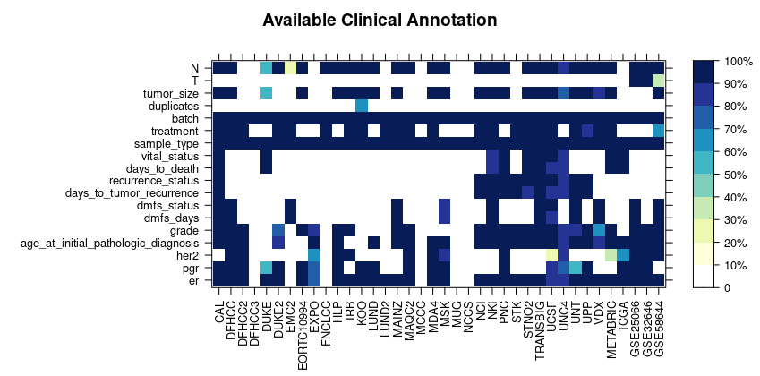

# metaGx breast cancer data sets
the [BioConductor package](https://www.bioconductor.org/packages/release/data/experiment/html/MetaGxBreast.html) is written up [here](https://pubmed.ncbi.nlm.nih.gov/31217513/).
- **microarray data:** links to expression sets from the metaGx breast cancer studies with alternate normalizations
- **metaGXcovarTable.csv.xz:** table of all sample covariates, including patient information, disease state, treatments, outcome, and microarray platform
- **controlModel.csv.xz:** subset of the above table containing all samples from untreated patients with outcome status (death and recurrence).  Covariates are age at diagnosis (`age_dx`), tumor profile [`grade`, node metastesis (`N`), immuno histo chemistry receptor status (`er`, `her2`, `pgr`)], `batch`, and microarray `Platform`.
- **MetaGxData.xlsx:** combined supplamentary data tables from the [metaGx paper](https://static-content.springer.com/esm/art%3A10.1038%2Fs41598-019-45165-4/MediaObjects/41598_2019_45165_MOESM2_ESM.xlsx) and the [_Three Genes_ paper](https://files.codeocean.com/files/verified/e0dd54f3-2274-4dd3-9280-ade92f8edfc8_v1.1/data/TABLE_1.xlsx?download) code dump.

## variables
description table coming soon

## studies
|study|batch|count|PMID|Dataset accession|Notes|
|:----------|:----------------|-----------:|:----------------------------------------------------------------------------|:-------------------------------------------------------------------------------------|:----------------------------------------------------------------------------------------------------------------------------|
|CAL        |  |         118|[17157792](https://www.ncbi.nlm.nih.gov/pubmed/17157792)                     |E-TABM-158                                                                            |Dataset of breast cancer patients from the University of California, San Francisco and the California Pacific Medical Center |
|DFHCC      |  |         115|[20098429](https://www.ncbi.nlm.nih.gov/pubmed/20098429)                     |[GSE19615](https://www.ncbi.nlm.nih.gov/geo/query/acc.cgi?acc=GSE19615)               |Dana-Farber Harvard Cancer Center                                                                                            |
|DFHCC2     |DFHCC2_CISPLATIN |          24|[20100965](https://www.ncbi.nlm.nih.gov/pubmed/20100965)                     |[GSE18864](https://www.ncbi.nlm.nih.gov/geo/query/acc.cgi?acc=GSE18864)               |Dana-Farber Harvard Cancer Center  |
|           |DFHCC2_REFERENCE |          59|  | | |
|DFHCC3     |  |          40|[16473279](https://www.ncbi.nlm.nih.gov/pubmed/16473279)                     |[GSE3744](https://www.ncbi.nlm.nih.gov/geo/query/acc.cgi?acc=GSE3744)                 |Dana-Farber Harvard Cancer Center  |
|DUKE       |  |         169|[16273092](https://www.ncbi.nlm.nih.gov/pubmed/16273092)                     |[GSE3143](https://www.ncbi.nlm.nih.gov/geo/query/acc.cgi?acc=GSE3143)                 |Duke university hospital |
|DUKE2      |  |         154|[18024211](https://www.ncbi.nlm.nih.gov/pubmed/18024211)                     |[GSE6861](https://www.ncbi.nlm.nih.gov/geo/query/acc.cgi?acc=GSE6861)                 |Duke university hospital |
|EMC2       |  |         204|[19421193](https://www.ncbi.nlm.nih.gov/pubmed/19421193)                     |[GSE12276](https://www.ncbi.nlm.nih.gov/geo/query/acc.cgi?acc=GSE12276)               |Erasmus Medical Center                                                                                                       |
|EORTC10994 |  |          47|[15897907](https://www.ncbi.nlm.nih.gov/pubmed/15897907)                     |[GSE1561](https://www.ncbi.nlm.nih.gov/geo/query/acc.cgi?acc=GSE1561)                 |Trial number 10994 from the European Organization for Research and Treatment of Cancer Breast Cancer                         |
|EXPO       |  |         350|Erin Curley ecurley@intgen.org                                               |[GSE2109](https://www.ncbi.nlm.nih.gov/geo/query/acc.cgi?acc=GSE2109)                 |Expression project for oncology, large dataset of microarray data published by the International Genomics Consortium         |
|FNCLCC     |  |         150|[17659439](https://www.ncbi.nlm.nih.gov/pubmed/17659439)                     |[GSE7017](https://www.ncbi.nlm.nih.gov/geo/query/acc.cgi?acc=GSE7017)                 |F_d_ration Nationale des Centres de Lutte contre le Cancer                                                                   |
|GSE25066   |  |         508|[21558518](https://www.ncbi.nlm.nih.gov/pubmed/21558518)                     |[GSE25066](https://www.ncbi.nlm.nih.gov/geo/query/acc.cgi?acc=GSE25066)               |Nuvera Biosciences                                                                                                           |
|GSE32646   |  |         115|[22320227](https://www.ncbi.nlm.nih.gov/pubmed/22320227)                     |[GSE32646](https://www.ncbi.nlm.nih.gov/geo/query/acc.cgi?acc=GSE32646)               |Osaka University                                                                                                             |
|GSE48091   |  |         623|[26077471](https://www.ncbi.nlm.nih.gov/pubmed/26077471)                     |[GSE48091](https://www.ncbi.nlm.nih.gov/geo/query/acc.cgi?acc=GSE48091)               |Karolinska Institutet                                                                                                        |
|GSE58644   |  |         318|[25284793](https://www.ncbi.nlm.nih.gov/pubmed/25284793)                     |[GSE58644](https://www.ncbi.nlm.nih.gov/geo/query/acc.cgi?acc=GSE58644)               |McGill University                                                                                                            |
|HLP        |  |          53|[19688261](https://www.ncbi.nlm.nih.gov/pubmed/19688261)                     |E-TABM-543                                                                            |University Hospital La Paz                                                                                                   |
|IRB        |  |         129|[18297396](https://www.ncbi.nlm.nih.gov/pubmed/18297396)                     |[GSE5460](https://www.ncbi.nlm.nih.gov/geo/query/acc.cgi?acc=GSE5460)                 |Dana Farber Cancer Institute                                                                                                 |
|KOO        |  |          35|[12747878](https://www.ncbi.nlm.nih.gov/pubmed/12747878)                     |Authors' website                                                                      |Koo Foundation Sun Yat-Sen Cancer Centre                                                                                     |
|LUND       |LUNDS1           |          30|[18430221](https://www.ncbi.nlm.nih.gov/pubmed/18430221)                     |[GSE31863](https://www.ncbi.nlm.nih.gov/geo/query/acc.cgi?acc=GSE31863)               |Lund University Hospital                                                                                                     |
|           |LUNDS2           |          47|  | | |
|           |LUNDS3           |          22|  | | |
|           |LUNDS4           |          44|  | | |
|LUND2      |  |         105|[17452630](https://www.ncbi.nlm.nih.gov/pubmed/17452630)                     |[GSE5325](https://www.ncbi.nlm.nih.gov/geo/query/acc.cgi?acc=GSE5325)                 |Lund University Hospital                                                                                                     |
|MAINZ      |  |         200|[18593943](https://www.ncbi.nlm.nih.gov/pubmed/18593943)                     |[GSE11121](https://www.ncbi.nlm.nih.gov/geo/query/acc.cgi?acc=GSE11121)               |Mainz hospital                                                                                                               |
|MAQC2      |  |          44|[20064235](https://www.ncbi.nlm.nih.gov/pubmed/20064235)                     |[GSE20194](https://www.ncbi.nlm.nih.gov/geo/query/acc.cgi?acc=GSE20194)               |Microarray quality control consortium                                                                                        |
|MCCC       |  |          75|[19960244](https://www.ncbi.nlm.nih.gov/pubmed/19960244)                     |[GSE19177](https://www.ncbi.nlm.nih.gov/geo/query/acc.cgi?acc=GSE19177)               |Peter MacCallum Cancer Centre                                                                                                |
|MDA4       |  |         123|[16896004](https://www.ncbi.nlm.nih.gov/pubmed/16896004)                     |MDACC DB                                                                              |MD Anderson Cancer Center                                                                                                    |
|METABRIC   |1                |         526|[22522925](https://www.ncbi.nlm.nih.gov/pubmed/22522925)                     |                                                                                      |                                                                                                                             |
|           |2                |         289|  | | |
|           |3                |         762|  | | |
|           |4                |         238|  | | |
|           |5                |         166|  | | |
|           |6                |         133|  | | |
|MSK        |  |          98|[16049480](https://www.ncbi.nlm.nih.gov/pubmed/16049480)                     |[GSE2603](https://www.ncbi.nlm.nih.gov/geo/query/acc.cgi?acc=GSE2603)                 |Memorial Sloan-Kettering                                                                                                     |
|MUG        |  |         152|[18592372](https://www.ncbi.nlm.nih.gov/pubmed/18592372)                     |[GSE10510](https://www.ncbi.nlm.nih.gov/geo/query/acc.cgi?acc=GSE10510)               |Medical University of Graz                                                                                                   |
|NCCS       |  |         183|[18636107](https://www.ncbi.nlm.nih.gov/pubmed/18636107)                     |[GSE5364](https://www.ncbi.nlm.nih.gov/geo/query/acc.cgi?acc=GSE5364)                 |National Cancer Centre of Singapore                                                                                          |
|NCI        |  |          99|[12917485](https://www.ncbi.nlm.nih.gov/pubmed/12917485)                     |Authors' website                                                                      |National Cancer Institute                                                                                                    |
|NKI        |NKI1              |         117|[12490681](https://www.ncbi.nlm.nih.gov/pubmed/12490681), [11823860](https://www.ncbi.nlm.nih.gov/pubmed/11823860) |Rosetta Inpharmatics                                                                  |National Kanker Instituut                                                                                                    |
|           |NKI2             |         220|  | | |
|PNC        |  |          91|[21910250](https://www.ncbi.nlm.nih.gov/pubmed/21910250)                     |[GSE20711](https://www.ncbi.nlm.nih.gov/geo/query/acc.cgi?acc=GSE20711)               |                                                                                                                             |
|STK        |  |         159|[16280042](https://www.ncbi.nlm.nih.gov/pubmed/16280042)                     |[GSE1456](https://www.ncbi.nlm.nih.gov/geo/query/acc.cgi?acc=GSE1456)                 |Stockholm                                                                                                                    |
|STNO2      |  |         118|[12829800](https://www.ncbi.nlm.nih.gov/pubmed/12829800)                     |[GSE4382](https://www.ncbi.nlm.nih.gov/geo/query/acc.cgi?acc=GSE4382)                 |Stanford/Norway                                                                                                              |
|TCGA       |  |        1073|[23000897](https://www.ncbi.nlm.nih.gov/pubmed/23000897)                     |                                                                                      |The Cancer Genome Atlas                                                                                                      |
|TRANSBIG   |VDXGUYU          |          36|[17545524](https://www.ncbi.nlm.nih.gov/pubmed/17545524)                     |[GSE7390](https://www.ncbi.nlm.nih.gov/geo/query/acc.cgi?acc=GSE7390)                 |Dataset collected by the TransBIG consortium                                                                                 |
|           |VDXIGRU          |          50|  | | |
|           |VDXKIU           |          51|                                                                             |                                                                   |  |
|           |VDXOXFU          |          24| | |
|           |VDXRHU           |          37|  | | |
|UCSF       |  |         161|[17428335](https://www.ncbi.nlm.nih.gov/pubmed/17428335), [14612510](https://www.ncbi.nlm.nih.gov/pubmed/14612510) |Authors' website                                                                      |University of California, San Francisco                                                                                      |
|UNC4       |  |         305|[20813035](https://www.ncbi.nlm.nih.gov/pubmed/20813035)                     |[GSE18229](https://www.ncbi.nlm.nih.gov/geo/query/acc.cgi?acc=GSE18229)               |University of Northern California                                                                                            |
|UNT        |KIU              |          64|[16478745](https://www.ncbi.nlm.nih.gov/pubmed/16478745), [17401012](https://www.ncbi.nlm.nih.gov/pubmed/17401012) |[GSE2990](https://www.ncbi.nlm.nih.gov/geo/query/acc.cgi?acc=GSE2990)                 |Cohort of untreated breast cancer patients from the Oxford Radcliffe (United Kingdom) and Karolinska (Sweden) hospital       |
|           |OXFU             |          69|  | | |
|UPP        |UPPT             |          80|[16141321](https://www.ncbi.nlm.nih.gov/pubmed/16141321)                     |[GSE3494](https://www.ncbi.nlm.nih.gov/geo/query/acc.cgi?acc=GSE3494)                 |Uppsala hospital                                                                                                             |
|           |UPPU             |         171|  | | |
|VDX        |VDX              |         286|[17420468](https://www.ncbi.nlm.nih.gov/pubmed/17420468), [15721472](https://www.ncbi.nlm.nih.gov/pubmed/15721472) |[GSE2034](https://www.ncbi.nlm.nih.gov/geo/query/acc.cgi?acc=GSE2034)/[GSE5327](https://www.ncbi.nlm.nih.gov/geo/query/acc.cgi?acc=GSE5327) |Veridex                                                                                                                      |
|           |VDXN             |          58|  | | |
