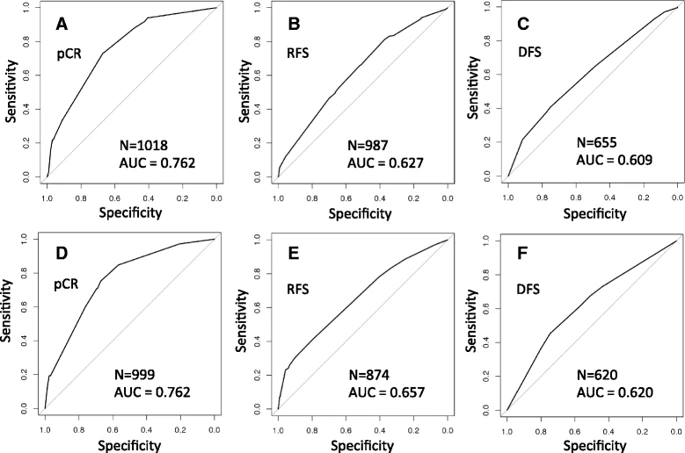

The Coincide meta-clustering procedure classifies tumor subtypes wit prognostic power comparable to the PAM50 centroids using the based on the same 50 gene subset.  The ROC curves below campare logistic regression models predicting 3 different long term (> 3 year) treatment outcomes using subtype label and three binary treatment variables from _curatedBreastData_:  `chemotherapy`, `anti-estrogen`, and `anti-HER2`.
  
  
Figure 4 from [[Planey 2016](https://www.ncbi.nlm.nih.gov/pubmed/26961683)].  **A - C** use category labels based on PAM50 centroids, **D - F** use Coincide category labels.
