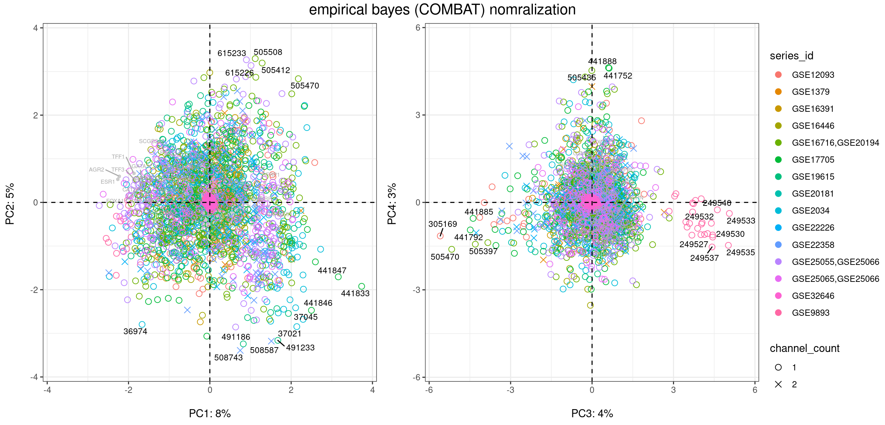

```{r setup, include=FALSE}
library(knitr)
opts_chunk$set( echo=FALSE, message=FALSE, warning=FALSE, paged.print=FALSE)
library(tidyverse)
```

::: {.fullwidth}
This report summarizes work done to model breast cancer progression by combining publicly available whole transcriptome tumor expression data sets. Run the notebook from the [cancer repo](https://github.com/singnet/cancer) `reports` directory to reproduce this R notebook output.
:::

## data sources and normalization

### **curatedBreastData** source data

describe *coincide* study subset{#coincideFig4}

```{r}
# show table of 15 studies

```

### spectral bigraphs

Spectral bigraphs[^1] are a blah blah blah...

[^1]: [spectal graph ref](https://www.researchgate.net/publication/265799819_SPECTRAL_MAP_ANALYSIS_-A_METHOD_TO_ANALYZE_GENE_EXPRESSION_DATA)

### **combat** empirical bayes normalization

```{r fig.height = 6, fig.width = 12.5, fig.fullwidth = TRUE}
# ggarrange(com12$plot, com34$plot, common.legend = TRUE, legend = "right") %>%
#   annotate_figure(top = text_grob("empirical bayes (COMBAT) nomralization", size = 15))

```

### differential expression analysis

### information content analysis

### cell type deconvolution

### logistic regression comparison

RFS \~ 1 + p5 + age + node + radio + tumor + grade + pr vs RFS \~ 1 + pam + age + node + radio + tumor + grade + pr

```{r}

```

## xgboost decision forest

## data space dimensional reduction methods

### OpenCog atomspace knowledge graph embeddings

#### opencog atomspace metagraph

#### probablistic logic network atrraction link inference

#### kernal PCA embedding

### InfoGAN dimension reduction & clustering

describe infogan & include image from google doc

```{r fig.margin=TRUE}
load("set15clust.rdata")
library(factoextra)
pam_wss
pam_sil
fviz_gap_stat(gap48_pam) + ggtitle("infoGAN 48 dimensional embedding vector\ngap statistic PAM clusters")
```

## 
