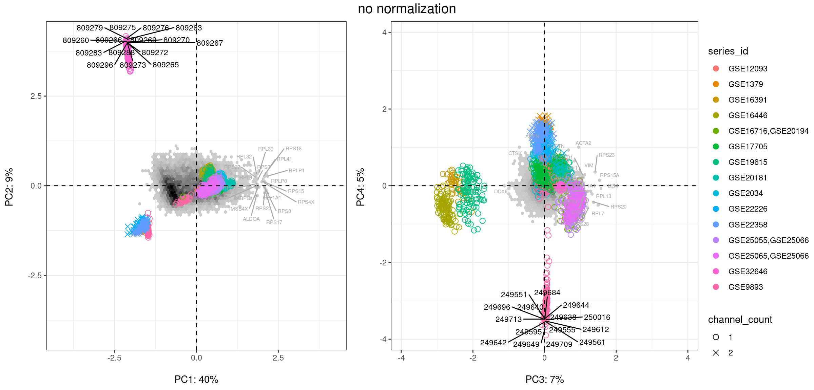

```{r setup, include=FALSE}
library(knitr)
opts_chunk$set( echo=FALSE, message=FALSE, warning=FALSE, paged.print=FALSE)
library(tidyverse)
```

::: {.fullwidth}
This report summarizes work done in the summer and fall of 2020 to prototype the integration of advanced machine learning techniques and Opencog symbolic inference for applications in applied biomedical research. Run the notebook from the [cancer repo](https://github.com/singnet/cancer) `reports` directory to reproduce this R notebook output.
:::

## data sources and normalization

### **curatedBreastData** R Bioconductor compilation of microarray data sets

describe cbd package

describe *coincide* study subset

```{r}
# show table of 15 studies
# library(printr)
# knitr::kable(read_csv())
```

describe normalization for meta-analysis

```{r fig.fullwidth = TRUE}


```

### spectral bigraphs

Spectral bigraphs[^1] are a blah blah blah...

[^1]: [spectal graph ref](https://www.researchgate.net/publication/265799819_SPECTRAL_MAP_ANALYSIS_-A_METHOD_TO_ANALYZE_GENE_EXPRESSION_DATA)

```{r fig.height = 6, fig.width = 12.5, fig.fullwidth = TRUE}
library(ggpubr)
load("set15specQC.rdata")
ggarrange(non12$plot, non34$plot, common.legend = TRUE, legend = "right") %>%
  annotate_figure(top = text_grob("no normalization", size = 15))
# 
```

In the raw combined data we can easily see the study source bias. In particular, [GSE9893 & GSE20194 blah blah]. Note the two channel studies marked with crosses in the lower right and top center of the principle component plots (name 3 studies? where is third in first plot?)

### batch mean centering

```{r fig.height = 6, fig.width = 12.5, fig.fullwidth = TRUE}
# ggarrange(bmc12$plot, bmc34$plot, common.legend = TRUE, legend = "right") %>%
#   annotate_figure(top = text_grob("batch mean centered (BMC) normalization", size = 15))

```

### **combat** empirical bayes normalization

```{r fig.height = 6, fig.width = 12.5, fig.fullwidth = TRUE}
# ggarrange(com12$plot, com34$plot, common.legend = TRUE, legend = "right") %>%
#   annotate_figure(top = text_grob("empirical bayes (COMBAT) nomralization", size = 15))
knitr::include_graphics('./cbtNorm.png')
```

```{r fig.margin=TRUE}
load("set15clust.rdata")
library(factoextra)
pam_wss
pam_sil
fviz_gap_stat(gap48_pam) + ggtitle("infoGAN 48 dimensional embedding vector\ngap statistic PAM clusters")
```

## InfoGAN dimension reduction & clustering

describe infogan & include image from google doc

## comparison with PAM50 clustering

### survival curves

```{r fig.height = 6, fig.width = 12.5, fig.fullwidth = TRUE}
library(survival)
library(ggfortify)
pdata15 <- read_csv("coincideClinDat.csv", guess_max = 2000)

pam50_fit <- survfit(Surv(months2, posOutcome2 == 0) ~ pam_coincide, data = pdata15)
p5_fit <- survfit(Surv(months2, posOutcome2 == 0) ~ p5, data = pdata15)

ggarrange(autoplot(pam50_fit, surv.connect = FALSE), autoplot(p5_fit, surv.connect = FALSE), legend = "right") %>%
  annotate_figure(top = text_grob("15 study - survival plot comparison", size = 15))
```

### GSE20194

This study blah blah blah

```{r fig.height = 6, fig.width = 12.5, fig.fullwidth = TRUE}
load("gse20194cbt_pam50.rdata")
ggarrange(s20194cbt$plot, s20194cbt_34$plot, common.legend = TRUE, legend = "right") %>%
  annotate_figure(top = text_grob("GSE20194 - PAM50 subtypes", size = 15))
```

```{r fig.height = 6, fig.width = 12.5, fig.fullwidth = TRUE}
load("gse20194cbt_infogan.rdata")
ggarrange(s20194cbti$plot, s20194cbti_34$plot, common.legend = TRUE, legend = "right") %>%
  annotate_figure(top = text_grob("GSE20194 - infoGAN PAM, k = 5", size = 15))
```

#### logistic regression comparison

### GSE9893

The outlier dataset examining relapse outcome in adjuvant tamoxifan treatment (PMID: [18347175](https://pubmed.ncbi.nlm.nih.gov/18347175/)[^2])

[^2]: Chanrion M, Negre V, et al. A gene expression signature that can predict the recurrence of tamoxifen-treated primary breast cancer. Clin Cancer Res. 2008 Mar 15;14(6):1744-52. doi: 10.1158/1078-0432.CCR-07-1833; PMCID: PMC2912334.

```{r fig.height = 6, fig.width = 12.5, fig.fullwidth = TRUE}
load("gse9893cbt_pam50.rdata")
ggarrange(s9893cbt$plot, s9893cbt_34$plot, common.legend = TRUE, legend = "right") %>%
  annotate_figure(top = text_grob("GSE9893 - PAM50 subtypes", size = 15))
```

```{r fig.height = 6, fig.width = 12.5, fig.fullwidth = TRUE}
load("gse9893cbt_infogan.rdata")
ggarrange(s9893cbti$plot, s9893cbti_34$plot, common.legend = TRUE, legend = "right") %>%
  annotate_figure(top = text_grob("GSE9893 - infoGAN PAM, k = 5", size = 15))
```

#### logistic regression comparison

RFS \~ 1 + p5 + age + node + radio + tumor + grade + pr vs RFS \~ 1 + pam + age + node + radio + tumor + grade + pr

```{r}
# gse9893p <- Biobase::pData(s3_9893$analysis$esetUsed) %>%
#   select(size = tumor_size_cm_preTrt_preSurgery, node = preTrt_lymph_node_status, tumor = tumor_stage_preTrt, grade = hist_grade, radio, age, er = ER_preTrt, pr = PR_preTrt, pam = pam_coincide, p5, RFS, )
# pam50 <- glm(RFS ~ 1 + pam + age + node + radio + tumor + grade + pr, family = binomial(link = logit), data = gse9893p)
# pam50pred <- predict(pam50, type = "response") >= 0.5
# pam50cm <- caret::confusionMatrix(data = as.factor(pam50pred),
#                                   reference = as.factor(gse9893p$RFS[as.numeric(names(pam50pred))] == "1"))

# igan <- glm(RFS ~ 1 + p5 + age + node + radio + tumor + grade + pr, family = binomial(link = logit), data = gse9893p)
# iganpred <- predict(igan, type = "response") >= 0.5
# igancm <- caret::confusionMatrix(data = as.factor(iganpred),
#                                  reference = as.factor(gse9893p$RFS[as.numeric(names(iganpred))] == "1")

```
